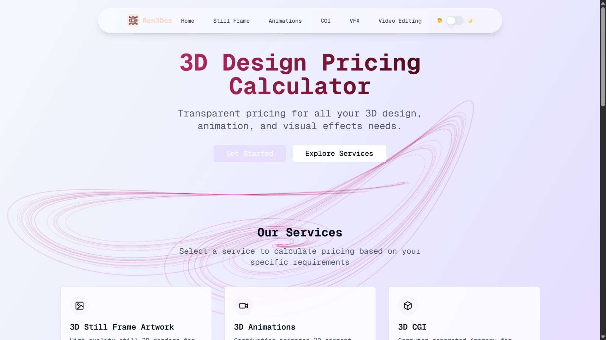
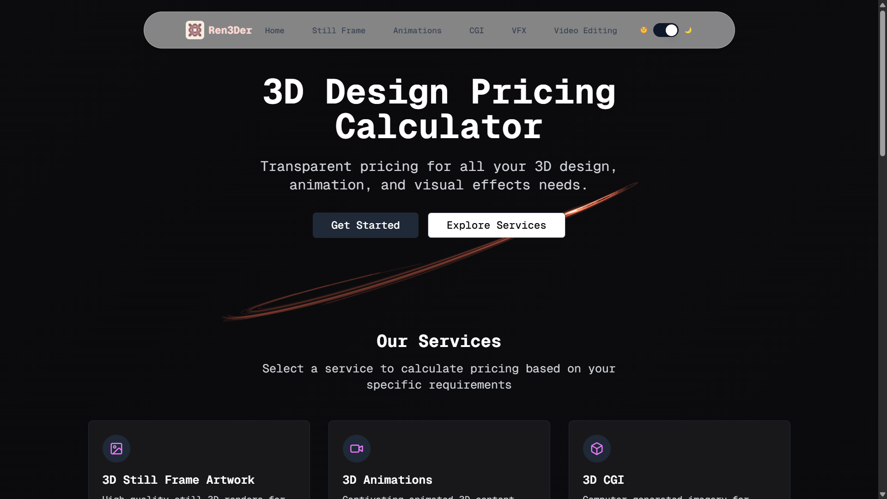
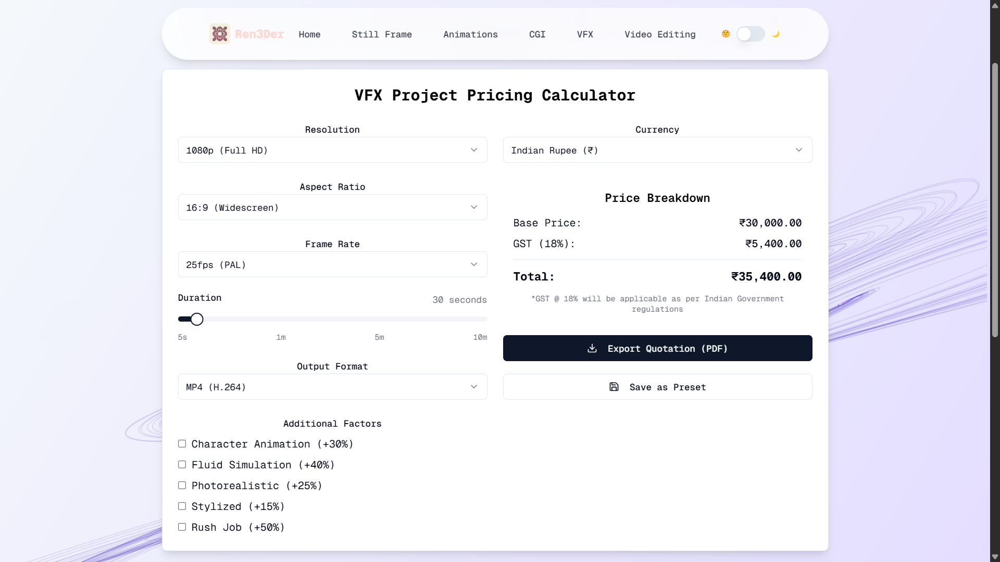

# Ren3Der

A modern 3D-Design Pricing Calculator and creative services platform.

## Screenshots

<!-- Replace these with your actual screenshots in the public/ folder -->




## Features
- 3D Still Frame Artwork pricing
- 3D Animations pricing
- VFX Projects and Video Editing services
- Interactive cursor trail effect
- Responsive design
- Built with Vite, React, TypeScript, shadcn-ui, and Tailwind CSS

## Getting Started

**Use your preferred IDE**

If you want to work locally using your own IDE, you can clone this repo and push changes.

The only requirement is having Node.js & npm installed - [install with nvm](https://github.com/nvm-sh/nvm#installing-and-updating)

Follow these steps:

```sh
# Step 1: Clone the repository using the project's Git URL.
git clone <YOUR_GIT_URL>

# Step 2: Navigate to the project directory.
cd <YOUR_PROJECT_NAME>

# Step 3: Install the necessary dependencies.
npm i

# Step 4: Start the development server with auto-reloading and an instant preview.
npm run dev
```

## Technologies Used
- Vite
- TypeScript
- React
- shadcn-ui
- Tailwind CSS